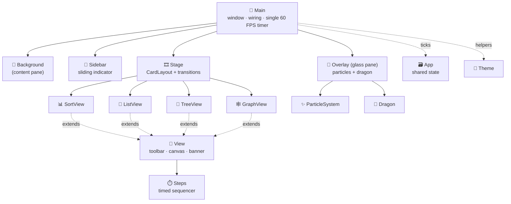

<div align="center">


<br/>


### ✨ *A futuristic DSA laboratory — everything is drawn in code.* ✨

[🚀 Quick Start](#-quick-start) •
[🎮 Features](#-features) •
[🕹️ Controls](#️-controls) •
[🧱 Architecture](#-architecture) •
[🛠️ Extend](#️-add-your-own-screen) •
[🗺️ Roadmap](#️-roadmap)

</div>

---

## 📖 About

**DSA Nexus** is a desktop **Data Structures & Algorithms visualization workstation** with a dark, glassy,
*pseudo-3D* look. Bars, nodes, trees and graphs animate smoothly while a tiny **energy dragon** follows your
cursor and a **particle network** reacts to your mouse.

> 🧪 100% **Core Java** — `Swing` + `AWT` + `Graphics2D`. No JavaFX. No OpenGL. No images. No dependencies.

---

## 🎮 Features

| | Module | Highlights |
|:-:|---|---|
| 📊 | **Sorting** | Pseudo-3D bars (front / top / side faces + shadow) • Bubble, Selection, Insertion • lift + glow on compare • bounce on swap • click & drag bars to edit heights • ✅ completion banner + particle burst |
| 🔗 | **Linked List** | 3D rounded nodes with depth & highlight • animated flowing arrows • `HEAD` / `NULL` markers • Add Head / Add Tail / Remove Head / Traverse • click a node to access it (scale + glow + ✦) |
| 🌳 | **Binary Search Tree** | Insert / Search / Random / Clear • path highlighted node-by-node • new node **flies out of its parent** into place • smooth re-layout • FOUND / NOT FOUND banner |
| 🕸️ | **Graph** | Click = add node • Drag = connect • Shift+Drag = move • Right-click = delete • **BFS • DFS • Dijkstra** with progressive shortest-path reveal |
| 🐉 | **Cursor Dragon** | 16-segment creature • smoothed follow • tilts with motion • idle breathing • stronger sway when you move fast |
| ✨ | **Particles** | Fading cursor trail • completion bursts • capped & reusable pool |
| 🌌 | **Background** | Drifting connected-particle network that gently repels from the mouse • faint grid |
| 🎛️ | **UI Polish** | Glass panels • hover glow & press animation • sliding sidebar indicator • ~240 ms slide + fade transitions |

---

## 🚀 Quick Start

### ✅ Requirements
- ☕ **JDK 11+** (developed on JDK 21) — a JRE alone is **not** enough, you need `javac`
- 🖥️ A desktop environment (it opens a Swing window)

### ▶️ Run

| OS | Command |
|---|---|
| 🪟 **Windows** | double-click **`run.bat`** |
| 🍎🐧 **macOS / Linux** | `./run.sh` &nbsp;*(first time: `chmod +x run.sh`)* |

Or manually:

```bash
javac -encoding UTF-8 -d out src/dsanexus/*.java
java  -cp out dsanexus.Main
```

<details>
<summary><b>💡 Using IntelliJ IDEA</b></summary>

1. **File → Open** the `DsaNexus` folder (a `DsaNexus.iml` module file is included)
2. Right-click `src` → **Mark Directory as → Sources Root**
3. Run **`dsanexus.Main`**

> ⚠️ *"Cannot resolve symbol View"?* A file is outside the package. Every `.java` file must live in
> `src/dsanexus/` and start with `package dsanexus;`.

</details>

---

## 🕹️ Controls

<table>
<tr><th>🧭 Screen</th><th>🎯 What you can do</th></tr>
<tr><td><b>Sidebar</b></td><td>Click <kbd>Sorting</kbd> <kbd>Linked List</kbd> <kbd>Tree</kbd> <kbd>Graph</kbd> to switch screens</td></tr>
<tr><td><b>📊 Sorting</b></td><td><kbd>Shuffle</kbd> <kbd>Bubble</kbd> <kbd>Selection</kbd> <kbd>Insertion</kbd> • click / drag bars to change heights (when idle)</td></tr>
<tr><td><b>🔗 Linked List</b></td><td><kbd>Add Tail</kbd> <kbd>Add Head</kbd> <kbd>Remove Head</kbd> <kbd>Traverse</kbd> • click a node to access it</td></tr>
<tr><td><b>🌳 Tree</b></td><td>Type a number → <kbd>Insert</kbd> or <kbd>Search</kbd> • <kbd>Insert Random</kbd> <kbd>Clear</kbd></td></tr>
<tr><td><b>🕸️ Graph</b></td><td>🖱️ <b>Click</b> empty space = add node • 🖱️ <b>Drag</b> node→node = connect • <kbd>Shift</kbd>+<b>Drag</b> = move • 🖱️ <b>Right-click</b> = delete node/edge • <kbd>BFS</kbd> <kbd>DFS</kbd> <kbd>Dijkstra</kbd> <kbd>Reset Marks</kbd> <kbd>Clear</kbd></td></tr>
</table>

---

## 🧱 Architecture



### 📂 Project structure

```text
DsaNexus/
├── 📄 README.md
├── 🖼️ assets/banner.svg
├── 🧩 DsaNexus.iml
├── ▶️ run.bat · run.sh
└── 📁 src/dsanexus/
    ├── 🚪 Main.java            window setup · wiring · single animation timer · mouse tracking
    ├── 🗃️ App.java             shared state (tickables, particles, dragon, overlay, mouse)
    ├── 🎨 Theme.java           colours + helpers (glass, damp, dashPhase, ...)
    ├── ⏱️ Tickable.java        interface for anything animated
    ├── 🌌 Background.java      animated particle-network background
    ├── 🧭 Sidebar.java         category list with sliding indicator
    ├── 🎞️ Stage.java           CardLayout host + slide/fade transitions
    ├── 🧩 View.java            base screen (toolbar, canvas, completion banner)
    ├── 📊 SortView.java        sorting visualization
    ├── 🔗 ListView.java        linked list visualization
    ├── 🌳 TreeView.java        BST visualization
    ├── 🕸️ GraphView.java       graph visualization (BFS / DFS / Dijkstra)
    ├── 🪜 Steps.java           timed step sequencer
    ├── 🔘 HoverButton.java     animated button
    ├── ✨ ParticleSystem.java  capped particle pool
    ├── 🐉 Dragon.java          cursor-following creature
    └── 🫧 Overlay.java         click-through glass pane
```

### ⚙️ Design principles

| 🧠 Principle | 🔍 How it is done |
|---|---|
| ⏲️ **One timer** | A single `javax.swing.Timer` (~16 ms) ticks every `Tickable`, updates particles, repaints. **No extra threads.** |
| 🚫 **Never block the UI** | Algorithms are precomputed into steps and replayed by `Steps` with delays |
| 🫧 **Click-through overlay** | The glass pane overrides `contains()` → `false`, so all mouse events reach the UI below |
| 🧊 **Pseudo-3D** | Extruded rounded rects, parallelogram top/side faces, radial-gradient spheres, shadows, layered alpha |
| 🌊 **Smooth motion** | Exponential smoothing (`Theme.damp`) for bars, nodes, dragon, sidebar |
| ⚡ **Performance** | Particles capped at 350, swap-removal of expired ones, hidden screens skip update/render |

---

## 🛠️ Add your own screen

<details>
<summary><b>3 steps — click to expand</b></summary>

1. **Create** `MyView.java` in `src/dsanexus/`:
   ```java
   package dsanexus;

   import java.awt.*;
   import static dsanexus.Theme.*;

   public class MyView extends View {
       public MyView() {
           addTool(new HoverButton("Do Thing", () -> complete("\u2713 DONE")));
       }
       void update(double dt) { /* animate state */ }
       void render(Graphics2D g, int w, int h) { /* draw */ }
   }
   ```
2. **Register** it in `Main.start()`:
   ```java
   stage.add(new MyView(), "My Screen");
   ```
3. **Add** `"My Screen"` to the string array passed to `new Sidebar(...)`.

</details>

---

## 🧯 Troubleshooting

| 😵 Problem | 🩹 Fix |
|---|---|
| `javac` not found | Install a **JDK** (not just a JRE) and add it to `PATH` |
| `IllegalArgumentException: negative dash phase` | Use `Theme.dashPhase(...)` — `BasicStroke` rejects negative phases |
| Symbols render as boxes | Compile with `-encoding UTF-8` (the run scripts already do) |
| Clicks seem blocked | `Overlay.contains()` must return `false` (default) |
| "Cannot resolve symbol" in IntelliJ | All files in `src/dsanexus/` with `package dsanexus;` + `src` marked as Sources Root |

---

## ⚠️ Known limitations

- 📋 Only **Sorting, Linked List, Tree, Graph** screens exist right now
- 🔗 Linked List supports a **singly** linked list only (head/tail add, head remove, traverse)
- 🧭 Dijkstra always runs from the **first** node to the **most recently created** node
- 🖼️ The whole window repaints every frame (the background is always animating)

## 🗺️ Roadmap

- [ ] 🔗 **Linked List upgrade** — Singly / Doubly / Circular / Circular Doubly lists • insert & delete at head, tail and index • forward / backward / circular traversal • **New** + **Clear** • index shown on every node • invalid-index validation
- [ ] 🔍 Searching (linear / binary)
- [ ] 📚 Stack & Queue
- [ ] 🧱 Pathfinding grid with wall painting (click + drag)
- [ ] 🖼️ Dirty-region repainting for lower CPU use

---

<div align="center">

### 💙 Built with pure Java & Graphics2D

*Educational / personal project — use and modify freely.*

⭐ **If you like it, star it!** ⭐

</div>
